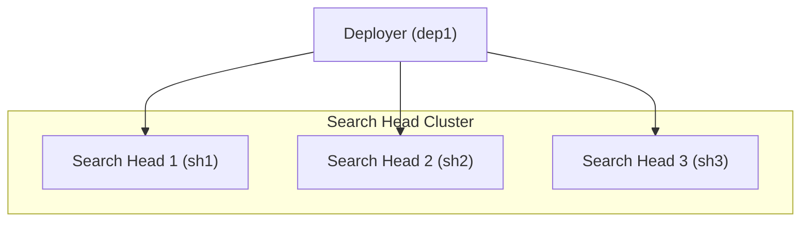

# Splunk Search Head Cluster Lab (Docker)

## Overview

This repository provides a **Docker-based Splunk Search Head Cluster (SHC) environment** designed to simulate a distributed Splunk search layer.

It demonstrates how multiple Search Heads operate as a cluster to provide:

* High availability
* Search workload distribution
* Centralized app management using a Deployer

---

## Environment Components

* 3 Search Heads
* 1 Deployer

This lab is useful for understanding:

* Search Head Cluster architecture
* Captain election process
* Deployer-based configuration management
* Search Head cluster formation and synchronization

---

## Architecture



---

## Components

| Component     | Hostname | Web Port | Management Port |
| ------------- | -------- | -------- | --------------- |
| Search Head 1 | sh1      | 8000     | 8089            |
| Search Head 2 | sh2      | 8000     | 8089            |
| Search Head 3 | sh3      | 8000     | 8089            |
| Deployer      | dep1     | 8000     | 8089            |

All containers run on the external Docker network:

```bash id="n7k3qp"
skynet
```

---

## Prerequisites

### 1. Install Docker

Install Docker and Docker Compose:

https://docs.docker.com/get-docker/

---

### 2. Create Docker Network

```bash id="h1x9aa"
docker network create skynet
```

---

### 3. Configure Environment Variables

Create a `.env` file in the project root:

```bash id="q0v8lw"
SPLUNK_PASSWORD=YourStrongPassword
SPLUNK_SHC_SECRET=SHClusterSecret123
```

---

## Deployment Modes

### 1. Base Environment (Manual Configuration)

This mode starts all components without automatically configuring the Search Head Cluster.

It allows you to practice:

* Initializing a Search Head Cluster
* Assigning a captain node
* Joining cluster members
* Configuring and deploying apps using the Deployer

Start the environment:

```bash id="r8p3md"
docker-compose -f docker-compose.manual.yml up -d
```

---

### 2. Preconfigured Search Head Cluster

This mode automatically configures the Search Head Cluster during startup:

* Initializes the Search Head Cluster
* Sets `sh1` as the initial captain
* Joins `sh1`, `sh2`, and `sh3` as cluster members
* Connects the Deployer to the cluster

Start the environment:

```bash id="t4x2kc"
docker-compose -f docker-compose.preconfigured.yml up -d
```

---

## Repository Structure

```bash id="z9l1qp"
.
├── .env
├── docker-compose.manual.yml
├── docker-compose.preconfigured.yml
├── README.md
└── docs/
    ├── deployment-guide.md
    └── post-deployment-validation.md
```
